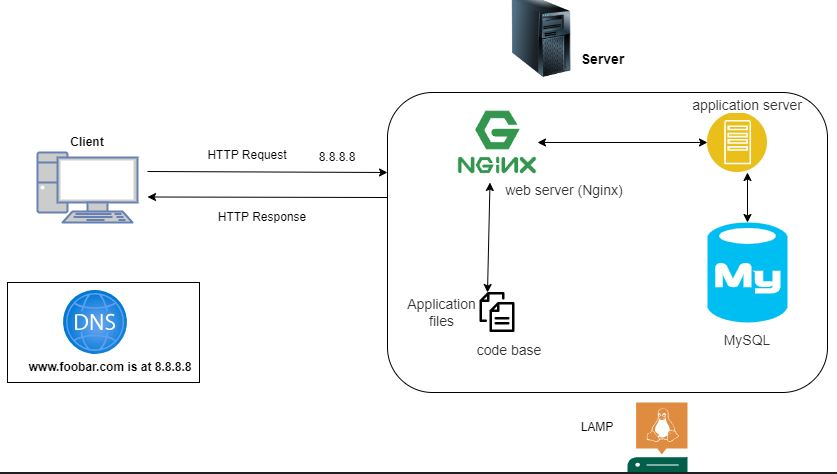

  

## Issues with this Infrastructure:
### 1. Single Point of Failure (SPOF):
Since we have only one server, any failure (hardware, software, or network) would impact the entire website. Consider redundancy or failover mechanisms to mitigate this risk.

### 2. Downtime during Maintenance:
When deploying new code or performing maintenance, the web server may need to be restarted. During this time, the website could experience downtime. Implement rolling updates or hot-swapping to minimize disruptions.

### 3. Scalability Challenges:
With only one server, scaling to handle high traffic becomes difficult. Consider load balancers, multiple servers, or cloud-based solutions to handle increased incoming traffic.
